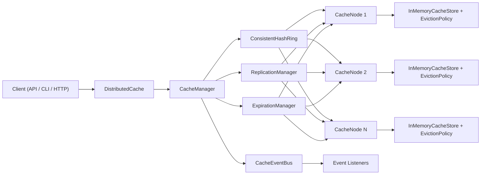

# Distributed Cache Architecture

## Overview

This project is a Java 17, Maven-based distributed-cache prototype. In its current form, it is a single-process simulation of a distributed cache: multiple logical cache nodes run inside one JVM and are coordinated by a central `CacheManager`.

The system supports:

- Key/value storage with optional TTL
- Multiple eviction policies: `LRU`, `LFU`, `FIFO`
- Key placement through consistent hashing with virtual nodes
- Replication with synchronous or asynchronous fan-out
- Dynamic node add/remove operations
- Event publication for cache activity
- Access through Java API, CLI shell, and HTTP endpoints

The packaged executable jar starts the Netty HTTP server by default.

## Runtime Surfaces

- Java API: `DistributedCache<K, V>`
- CLI shell: `com.lld.cache.CacheServer`
- HTTP server: `com.lld.cache.server.HttpCacheServer`

## Main Components

### 1. `DistributedCache`

Thin public facade over the singleton `CacheManager`. It exposes the core operations:

- `put`
- `get`
- `delete`
- `exists`
- `addNode`
- `removeNode`
- event subscription

### 2. `CacheManager`

Central coordinator for the whole system. Responsibilities:

- Owns the cluster configuration
- Maintains the logical node map
- Resolves primary node placement through the consistent hash ring
- Triggers replication to replica nodes
- Starts and stops background expiration cleanup
- Publishes node lifecycle events

`CacheManager` is implemented as a JVM-wide singleton, so all `DistributedCache` instances in the same process share the same underlying manager.

### 3. `ConsistentHashRing`

Maps keys to logical nodes using MD5-based hashing and configurable virtual nodes. This reduces redistribution when nodes are removed and provides the basis for replica selection.

### 4. `CacheNode`

Represents a logical cache shard. `CacheNodeImpl` combines:

- `InMemoryCacheStore`
- an eviction policy instance
- lazy expiration checks
- per-node locking for concurrent access

Each node handles local CRUD, TTL checks, eviction, and local event emission.

### 5. `ReplicationManager`

Selects replica nodes from the hash ring and delegates replication through a strategy:

- `SyncReplicationStrategy`
- `AsyncReplicationStrategy`

Writes and deletes are replicated. Reads first check the primary node and then fall back to replica nodes when necessary.

### 6. `ExpirationManager`

Runs scheduled cleanup across all active nodes. Expiration is handled in two ways:

- Lazy expiration on reads and `exists`
- Active background cleanup at a configured interval

### 7. `CacheEventBus`

Asynchronous event dispatcher for cache listeners. Implemented events include:

- `PUT`
- `DELETE`
- `EVICTION`
- `EXPIRATION`
- `NODE_ADDED`
- `NODE_REMOVED`

## Request Flow

### Write Path

1. Client issues `put(key, value[, ttl])`
2. `CacheManager` hashes the key to a primary node
3. Primary `CacheNode` stores the entry locally
4. If capacity is reached, the node evicts according to its configured policy
5. `ReplicationManager` copies the entry to replica nodes
6. Events are emitted asynchronously

### Read Path

1. Client issues `get(key)`
2. `CacheManager` resolves the primary node
3. Primary node checks local storage and TTL
4. If the primary misses and replication is enabled, replicas are checked
5. Value is returned as `Optional<V>`

### Node Removal Path

1. `CacheManager` snapshots entries from the removed node
2. The node is removed from the hash ring and node map
3. Entries are reassigned to their new primary owners
4. Re-replication is triggered from the new placement

## High-Level Design

## Configuration

The cache is configured through `CacheConfig.Builder`, including:

- `maxEntriesPerNode`
- `evictionPolicy`
- `defaultTtl`
- `replicationFactor`
- `replicationMode`
- `virtualNodeCount`
- `expirationCleanupInterval`

## Current Limits

This is a strong prototype, but it is not a real distributed cluster yet.

- All nodes live in one JVM; there is no networked node-to-node communication
- Storage is in-memory only; there is no persistence or recovery
- Node addition does not rebalance existing keys
- There is no gossip, heartbeating, quorum, or failover protocol
- The HTTP layer uses a lightweight hand-rolled request parser rather than a full JSON stack

## Verification

The current implementation is backed by unit and integration tests covering:

- CRUD operations
- TTL expiration
- eviction behavior
- replication
- node add/remove flows
- event delivery
- concurrent access

At the time of writing, the full Maven test suite passes.
